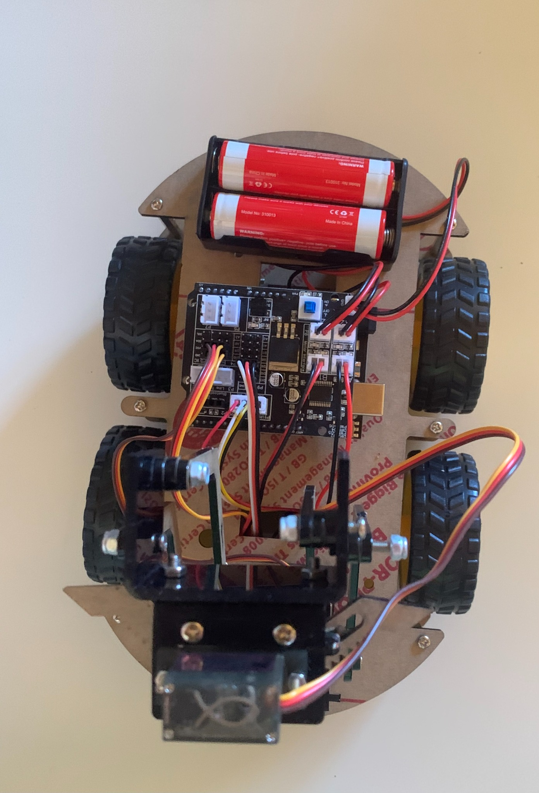
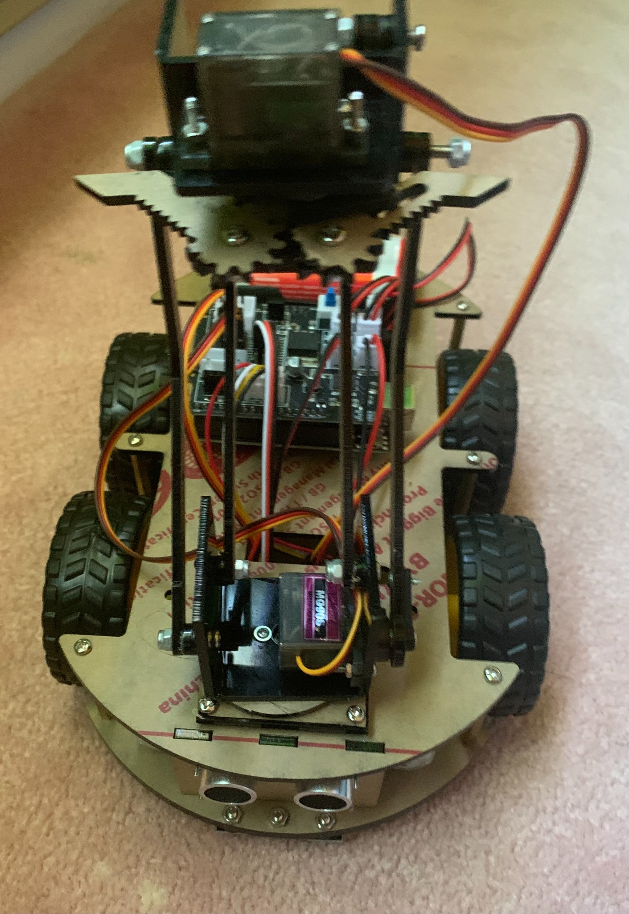
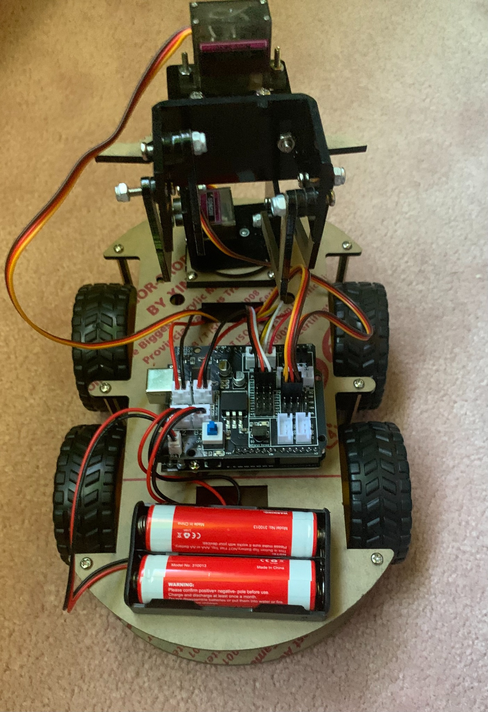
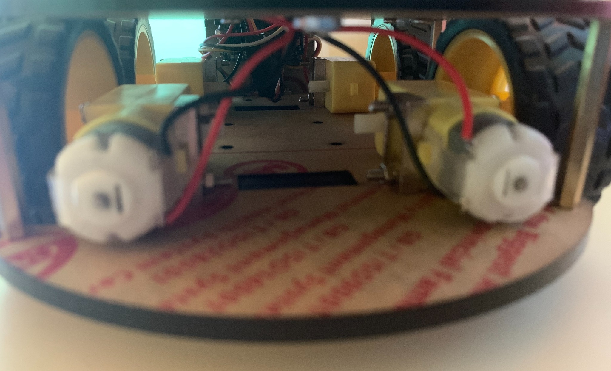

# Autonomous Mobile Robot (AMR) Platform






## Project Overview

Assembled the LAFVIN 4WD Smart Car kit, which consisted of wiring an Arduino Uno to an L298N motor driver and an HC‑SR04 ultrasonic sensor. Adapted C++ sketches from online examples to implement reactive obstacle avoidance, custom drive patterns, timed maneuvers and sensor‑data acquisition. Documented code iterations, wiring configurations and test results in a technical log to improve iterative learning in embedded firmware development.

## System Architecture

* **Microcontroller:** Arduino Uno R3 (ATmega328P, 16 MHz, 5 V logic).  
* **Motor Driver:** L298N dual H‑bridge (TB6612FNG also compatible).  
* **Motors:** Four DC reduction gear motors providing high torque at lower speed for controlled movement.  
* **Sensors:** HC‑SR04 ultrasonic distance sensor (2 cm–400 cm range).  
* **Manipulator:** Three PWM‑controlled servos (base, arm and claw).  
* **Power Supply:** 7.4 V Li‑Po battery regulated to 5 V for the electronics.

## Hardware Components

* **Arduino Uno R3:** Central microcontroller managing sensors and actuators.  
* **L298N Motor Driver:** Controls motors for precise directional and speed control using PWM.  
* **Reduction Motors:** Provide increased torque at reduced speeds, ideal for robotic movements that require both strength and precision.  
* **Servo Motors:** Position‑controlled actuators for manipulator control via PWM signals.  
* **HC‑SR04 Ultrasonic Sensor:** Measures distance through ultrasonic pulses for real‑time obstacle detection.

## Electrical Wiring & Pin Mapping

| Function | Component Pin | Arduino Pin |
|---------|---------------|-------------|
| Ultrasonic Trigger | TRIG | D12 |
| Ultrasonic Echo | ECHO | D13 |
| Left Motor Direction | IN1 | D2 |
| Left Motor PWM | ENA | D5 |
| Right Motor Direction | IN3 | D4 |
| Right Motor PWM | ENB | D6 |
| Claw Servo | Signal | D9 |
| Arm Servo | Signal | D10 |
| Base Servo | Signal | D11 |

## Firmware Overview

### Obstacle‑Avoidance Program

```cpp
// Pins
const int trigPin = 12;
const int echoPin = 13;
const int in1  = 2;  // left motor direction
const int pwmL = 5;  // left motor speed
const int in3  = 4;  // right motor direction
const int pwmR = 6;  // right motor speed

// Speeds and thresholds
const float THRESHOLD  = 25.0; // cm to start avoidance
const int   SLOW_DIST  = 15;   // cm to trigger backup
const int   FWD_SPEED  = 100;  // forward PWM value
const int   TURN_SPEED = 90;
const int   BACK_SPEED = 90;

float checkDistance() {
  digitalWrite(trigPin, LOW);
  delayMicroseconds(3);
  digitalWrite(trigPin, HIGH);
  delayMicroseconds(15);
  digitalWrite(trigPin, LOW);
  long dur = pulseIn(echoPin, HIGH);
  return dur / 58.0; // convert to cm
}

void setup() {
  pinMode(trigPin, OUTPUT);
  pinMode(echoPin, INPUT);
  pinMode(in1, OUTPUT);
  pinMode(pwmL, OUTPUT);
  pinMode(in3, OUTPUT);
  pinMode(pwmR, OUTPUT);
}

void loop() {
  float d = checkDistance();
  if (d > 0 && d <= THRESHOLD) {
    Stop();
    delay(100);
    if (d <= SLOW_DIST) {
      Move_Backward(BACK_SPEED);
      delay(600);
    } else {
      Rotate_Left(TURN_SPEED);
      delay(600);
    }
  } else {
    Move_Forward(FWD_SPEED);
  }
}

void Stop() {
  analogWrite(pwmL, 0);
  analogWrite(pwmR, 0);
}

void Move_Backward(int sp) {
  digitalWrite(in1, LOW);
  digitalWrite(in3, HIGH);
  analogWrite(pwmL, sp);
  analogWrite(pwmR, sp);
}

void Rotate_Left(int sp) {
  digitalWrite(in1, LOW);
  digitalWrite(in3, LOW);
  analogWrite(pwmL, sp);
  analogWrite(pwmR, sp);
}

void Move_Forward(int sp) {
  digitalWrite(in1, HIGH);
  digitalWrite(in3, LOW);
  analogWrite(pwmL, sp);
  analogWrite(pwmR, sp);
}
```

### Servo Manipulator Control

```cpp
#include <Servo.h>

Servo clawServo;   // Claw on D9
Servo armServo;    // Arm on D10
Servo baseServo;   // Base on D11

const int CLAW_CLOSED = 180; // grip
const int CLAW_OPEN   = 10;  // release
const int ARM_UP      = 60;  // raised arm
const int ARM_DOWN    = 140; // lowered arm
const int BASE_HOME   = 90;  // forward
const int BASE_TURN   = 180; // right drop zone
const int MOVE_DELAY  = 1000; // 1 second

void setup() {
  clawServo.attach(9);
  delay(50);
  armServo.attach(10);
  delay(50);
  baseServo.attach(11);
  delay(50);
  baseServo.write(BASE_HOME);
  armServo.write(ARM_UP);
  clawServo.write(CLAW_OPEN);
  delay(MOVE_DELAY);
}

void loop() {
  armServo.write(ARM_DOWN);
  delay(MOVE_DELAY);
  clawServo.write(CLAW_CLOSED);
  delay(MOVE_DELAY);
  armServo.write(ARM_UP);
  delay(MOVE_DELAY);
  baseServo.write(BASE_TURN);
  delay(MOVE_DELAY);
  armServo.write(ARM_DOWN);
  delay(MOVE_DELAY);
  clawServo.write(CLAW_OPEN);
  delay(MOVE_DELAY);
  armServo.write(ARM_UP);
  delay(MOVE_DELAY);
  baseServo.write(BASE_HOME);
  delay(MOVE_DELAY);
}
```

## Testing & Validation

Extensive trials were carried out to evaluate obstacle‑avoidance reliability and servo precision. In controlled cardboard‑bounded environments the car successfully avoided obstacles roughly 95 % of the time and accurately manipulated lightweight objects using the servo arm. Sensor data and system responses were logged to inform iterative debugging.

## Challenges & Solutions

* **Sensor accuracy:** Early HC‑SR04 readings were noisy. Repositioning the ultrasonic module and refining the timing logic improved consistency.  
* **Motor synchronisation:** Wheel slip occasionally caused drift. Gradual acceleration via PWM ramping reduced slippage and improved straight‑line travel.

## Performance Improvements

Calibration and iterative debugging improved sensor accuracy, servo synchronisation and overall system reliability. The vehicle now exhibits responsive obstacle avoidance and repeatable manipulator actions based on code uploaded to the microcontroller.

## Personal Reflection

This self‑directed project deepened my practical skills in embedded systems, real‑time programming, PWM control and iterative troubleshooting. Working through wiring, firmware, debugging and documentation has strengthened both my theoretical understanding and hands‑on proficiency with microcontroller‑driven robotics.
